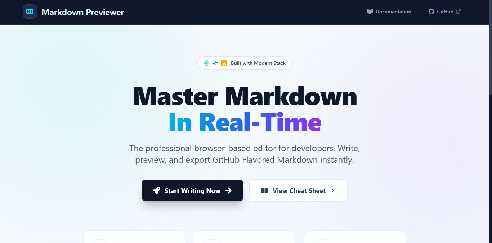

# Markdown Previewer

## Live Website
   https://markdown-editor-077h.onrender.com/



A feature-rich Markdown editor with live preview, built with React and Vite. Perfect for developers, technical writers, and content creators who need instant feedback while writing Markdown.

## Features

### Core Functionality
- **Real-time Rendering**: Instant preview as you type
- **GitHub Flavored Markdown**: Full support for tables, task lists, and code blocks
- **Responsive Design**: Optimized for all screen sizes
- **Theme Toggle**: Switch between Editor/Preview modes

### Productivity Boosters
- **Syntax Highlighting**: Language-specific code coloring
- **One-Click Copy**: Copy Markdown with a single button
- **HTML Export**: Save your formatted content as HTML
- **Built-in Cheatsheet**: Quick reference guide

### Technical Highlights
- **Performance Optimized**: Smooth rendering even with large documents
- **Keyboard Shortcuts**: Quick access to common actions
- **Modern Stack**: React + Vite for fast development
- **Accessible UI**: Proper ARIA labels and keyboard navigation

## Installation

1. Clone the repository:
   ```bash
   git clone https://github.com/Rohit03022006/markdown-previewer.git
   ```
2. Navigate to the project directory:
   ```bash
   cd markdown-previewer
   ```
3. Install dependencies:
   ```bash
   npm install
   ```
4. Start the development server:
   ```bash
   npm run dev
   ```
Then open [http://localhost:3000](http://localhost:3000) in your browser.

## Technologies Used

| Technology | Purpose |
|------------|---------|
| React + Vite | Frontend framework and build tool |
| Marked.js | Markdown parsing and rendering |
| React Icons | Beautiful SVG icons |
| CSS3 | Modern styling with variables |
| GitHub Flavored Markdown | Extended Markdown support |

## Usage Guide

1. **Write** your content in the editor panel
2. **Preview** renders instantly in the right panel
3. **Use Tools**:
   - Toggle editor/preview modes
   - Copy Markdown to clipboard
   - Export as HTML file
   - Switch between light/dark themes

## Contributing

We welcome contributions! Here's how:

1. Fork the repository
2. Create your feature branch (`git checkout -b feature/your-feature`)
3. Commit your changes (`git commit -m 'Add some feature'`)
4. Push to the branch (`git push origin feature/your-feature`)
5. Open a Pull Request

## Contact

For questions or feedback:
- Email: [kumarrohit67476@gmail.com](mailto:kumarrohit67476@gmail.com)
- GitHub: [Rohit03022006](https://github.com/Rohit03022006)

Project Link: [https://github.com/Rohit03022006/markdown-previewer](https://github.com/Rohit03022006/markdown-previewer)

##  Acknowledgments

- [Marked.js](https://marked.js.org) for powerful Markdown parsing
- [React Icons](https://react-icons.github.io) for beautiful icons
- GitHub for their [Markdown spec](https://github.github.com/gfm/)

